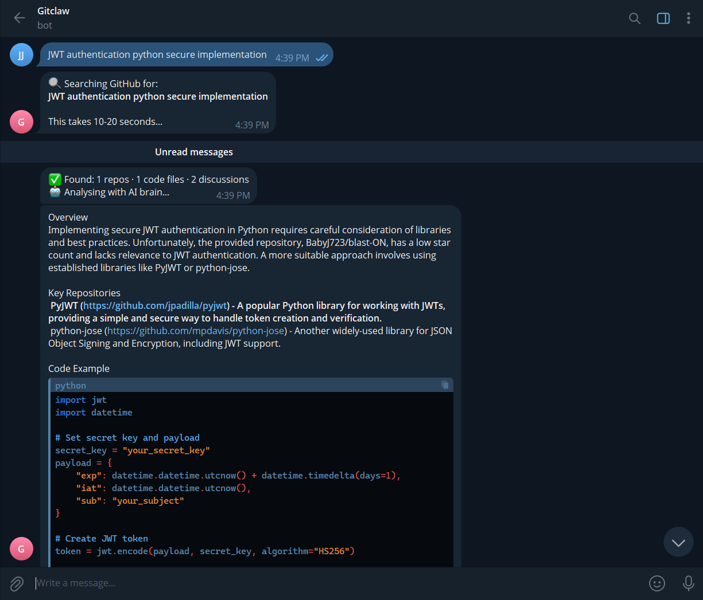
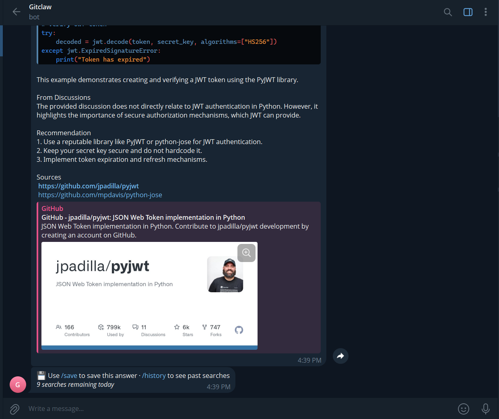

# 🦅 GitClaw

> AI-powered GitHub research assistant — get structured answers from repositories, code, and discussions in seconds.

Built for developers and cybersecurity professionals who want faster, smarter GitHub research.

---

## 🎯 Problem

Searching GitHub manually is inefficient:

* Opening multiple repositories
* Reading long READMEs
* Digging through issues and discussions
* No clear, consolidated answer

Even AI tools don’t directly analyze GitHub repositories with full context.

---

## 🚀 Solution

GitClaw acts as your **AI GitHub research assistant**:

```
You ask a question → GitClaw searches GitHub → AI analyzes everything → You get a structured answer
```

It combines:

* Repository discovery
* Code extraction
* Discussion insights
* AI-powered summarization

---

## ✨ Features

* 🔍 Deep GitHub search (repositories + code + discussions)
* 🤖 AI-powered structured answers (Groq + Llama 3.3 70B)
* 🧠 Context-aware memory (supports follow-up queries)
* 💾 Personal vault (save useful answers)
* 🔐 Cybersecurity-focused (works for general dev topics too)
* ⚡ Fast responses (~10–20 seconds)
* 💰 100% free stack

---

## 🎬 Example

**Query:**

```
How to implement JWT authentication in FastAPI
```

**Output includes:**

* Relevant repositories with links
* Working code snippet
* Community insights
* Clear implementation recommendation

---

## ⚡ Why GitClaw?

| Traditional GitHub Search | GitClaw                     |
| ------------------------- | --------------------------- |
| Open multiple repos       | One structured answer       |
| Manual code reading       | Extracted code snippets     |
| No discussion context     | Includes community insights |
| Time-consuming            | ~20 seconds                 |

GitClaw behaves like a **research assistant**, not just a search tool.

---

## 📱 Commands

| Command            | Description        |
| ------------------ | ------------------ |
| Just type anything | Search + AI answer |
| `/start`           | Welcome message    |
| `/help`            | Show commands      |
| `/history`         | Last 5 searches    |
| `/save`            | Save answer        |
| `/vault`           | View saved answers |
| `/clear`           | Clear history      |

---

## 💬 Example Queries

```
JWT authentication python secure implementation
```


```
XSS prevention in React best practices
```

```
Rate limiting Redis Node.js example
```

```
ISO 27001 automation tools open source
```

---

## 🛠️ Setup

### Prerequisites

* Python 3.10+
* Telegram account
* GitHub account
* Groq account (free)

---

### 1. Clone repository

```bash
git clone https://github.com/YOUR_USERNAME/gitclaw.git
cd gitclaw
pip install -r requirements.txt
```

---

### 2. Configure environment variables

Create a `.env` file:

```env
TELEGRAM_TOKEN=your_token
GITHUB_TOKEN=your_token
GROQ_API_KEY=your_key
```

---

### 3. Run the bot

```bash
python bot.py
```

Open Telegram → start your bot → begin querying 🎉

---

## 🌐 Deployment (24/7 Free)

Use Oracle Cloud Free VM:

```bash
sudo apt update && sudo apt install python3 python3-pip git -y

git clone https://github.com/YOUR_USERNAME/gitclaw.git
cd gitclaw
pip3 install -r requirements.txt

export TELEGRAM_TOKEN="xxx"
export GITHUB_TOKEN="xxx"
export GROQ_API_KEY="xxx"

python3 bot.py
```

---

## 📁 Project Structure

```
gitclaw/
├── bot.py
├── brain.py
├── github_search.py
├── memory.py
├── config.py
├── requirements.txt
├── README.md
├── LICENSE
├── .env.example
```

---

## ⚙️ Configuration

Edit `config.py`:

| Setting         | Description      |
| --------------- | ---------------- |
| GROQ_MODEL      | LLM model        |
| MAX_REPOS       | Repo limit       |
| MAX_CODE_FILES  | Code limit       |
| MAX_DISCUSSIONS | Discussion limit |

---

## ⚠️ Limitations

* Depends on GitHub search quality
* Free Groq tier has token limits
* Large queries may be truncated

---

## 🤝 Contributing

Ideas:

* Stack Overflow integration
* CVE/NVD search
* Daily GitHub digest
* Web dashboard

Pull requests are welcome.

---

## 📄 License

MIT License

---

## 👤 Author

**Kosal Marathe**
ICT Engineering (GTU)
Intern @ Sentrolis Infosec (CERT-In empaneled cybersecurity firm)
Surat, India.

---

## 🔥 Final Note

GitClaw is designed to **reduce GitHub research time from hours to minutes**.

> Search smarter. Build faster.
